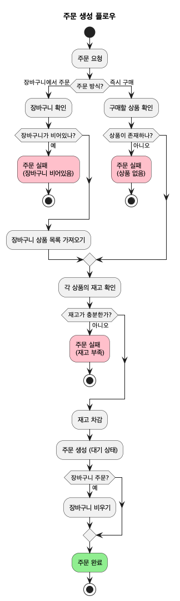
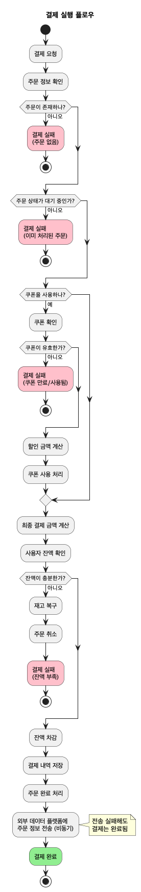
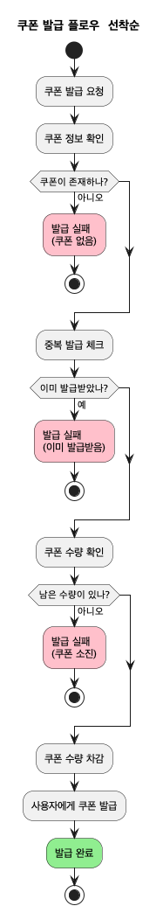
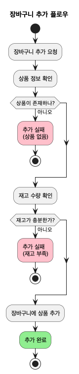

# 이커머스 서비스

## 프로젝트 목적

본 프로젝트는 **백엔드 개발 학습**을 목적으로 합니다.

실제 이커머스의 복잡한 비즈니스 로직을 최대한 단순화하여, 핵심적인 기술 요소에 집중할 수 있도록 설계되었습니다. 따라서 실무에서 필요한 다양한 예외 케이스, 복잡한 비즈니스 규칙, 다양한 결제 수단, 기능 등은 의도적으로 제외함과 더불어 DB나 API 설계도 단순화하였습니다.

**학습 중점 영역**:
- 동시성 제어 (재고 차감, 쿠폰 발급, 잔액 관리)
- 트랜잭션 관리
- 데이터 정합성 보장
- API 설계 및 구현

---

## Step 1: 요구사항 분석

### 1.1 핵심 기능 요구사항

[📄 요구사항 상세 문서](./documents/requirements.md)

#### 주요 기능
- **상품**: 목록 조회, 상세 조회, 인기 상품 조회
- **장바구니**: 추가, 삭제, 조회
- **주문**: 주문 생성 (장바구니/즉시구매), 주문 조회
- **결제**: 잔액 조회/충전, 결제 실행
- **쿠폰**: 선착순 발급, 쿠폰 조회, 쿠폰 사용

#### 동시성 제어 요구사항
- 재고 차감 (주문 생성 시)
- 쿠폰 발급 (선착순)
- 잔액 차감 (결제 시)

---

### 1.2 프로세스 플로우

#### 주문 생성 플로우

장바구니 주문과 즉시 구매 방식을 지원하며, 재고 확인 및 차감 과정을 포함합니다.

---

#### 결제 실행 플로우

쿠폰 할인 적용, 잔액 확인 및 차감, 주문 완료 처리를 포함한 전체 결제 프로세스입니다.

---

#### 쿠폰 발급 플로우

선착순 쿠폰 발급 시 수량 관리 및 중복 발급 방지 프로세스입니다.

---

#### 장바구니 추가 플로우

상품 재고 검증을 포함한 장바구니 추가 프로세스입니다.

---
