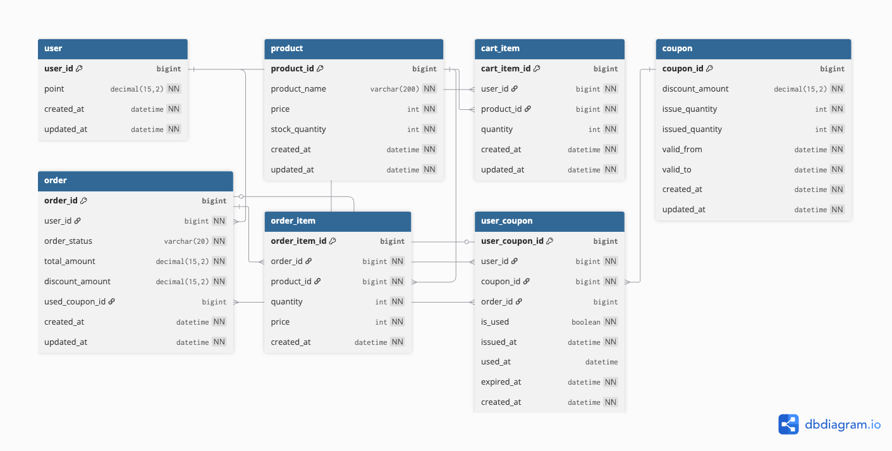

# 이커머스 서비스

## 프로젝트 목적

본 프로젝트는 **백엔드 개발 학습**을 목적으로 합니다.

실제 이커머스의 복잡한 비즈니스 로직을 최대한 단순화하여, 핵심적인 기술 요소에 집중할 수 있도록 설계되었습니다. 따라서 실무에서 필요한 다양한 예외 케이스, 복잡한 비즈니스 규칙, 다양한 결제 수단, 기능 등은 의도적으로 제외함과 더불어 DB나 API 설계도 단순화하였습니다.

**학습 중점 영역**:
- 동시성 제어 (재고 차감, 쿠폰 발급, 잔액 관리)
- 트랜잭션 관리
- 데이터 정합성 보장
- API 설계 및 구현

---

## 📑 목차

- [프로젝트 목적](#프로젝트-목적)
- [Step 1: 요구사항 분석](#step-1-요구사항-분석)
  - [1.1 핵심 기능 요구사항](#11-핵심-기능-요구사항)
  - [1.2 프로세스 플로우](#12-프로세스-플로우)
- [Step 2: API 설계](#step-2-api-설계)
  - [2.1 상품 API](#21-상품-api)
  - [2.2 장바구니 API](#22-장바구니-api)
  - [2.3 주문 API](#23-주문-api)
  - [2.4 결제 API](#24-결제-api)
  - [2.5 쿠폰 API](#25-쿠폰-api)
  - [2.6 에러 코드 정의](#26-에러-코드-정의)
- [Step 3: 데이터베이스 설계](#step-3-데이터베이스-설계)
  - [3.1 ERD (Entity Relationship Diagram)](#31-erd-entity-relationship-diagram)
  - [3.2 엔티티 관계도](#32-엔티티-관계도)
  - [3.3 테이블 상세](#33-테이블-상세)

---

## Step 1: 요구사항 분석

### 1.1 핵심 기능 요구사항

[📄 요구사항 상세 문서](./documents/requirements.md)

#### 주요 기능
- **상품**: 목록 조회, 상세 조회, 인기 상품 조회
- **장바구니**: 추가, 삭제, 조회
- **주문**: 주문 생성 (장바구니/즉시구매), 주문 조회
- **결제**: 잔액 조회/충전, 결제 실행
- **쿠폰**: 선착순 발급, 쿠폰 조회, 쿠폰 사용

#### 동시성 제어 요구사항
- 재고 차감 (주문 생성 시)
- 쿠폰 발급 (선착순)
- 잔액 차감 (결제 시)

---

### 1.2 프로세스 플로우

#### 주문 생성 플로우


장바구니 주문과 즉시 구매 방식을 지원하며, 재고 확인 및 차감 과정을 포함합니다.

---

#### 결제 실행 플로우


쿠폰 할인 적용, 잔액 확인 및 차감, 주문 완료 처리를 포함한 전체 결제 프로세스입니다.

---

#### 쿠폰 발급 플로우


선착순 쿠폰 발급 시 수량 관리 및 중복 발급 방지 프로세스입니다.

---

#### 장바구니 추가 플로우


상품 재고 검증을 포함한 장바구니 추가 프로세스입니다.

---

## Step 2: API 설계

[📄 API 명세 전체 문서](./documents/api-spec.md)

### 2.1 상품 API

**주요 엔드포인트**:
- `GET /api/products` - 상품 목록 조회 (페이징, 검색)
- `GET /api/products/{productId}` - 상품 상세 조회
- `GET /api/products/popular` - 인기 상품 조회 (최근 3일간 판매량 Top 5)

#### [📋 상품 API 상세보기](./documents/api-spec.md#1-상품-api)

---

### 2.2 장바구니 API

**주요 엔드포인트**:
- `GET /api/users/{userId}/carts` - 장바구니 조회
- `POST /api/users/{userId}/carts` - 장바구니 추가
- `PATCH /api/users/{userId}/carts/{cartItemId}` - 장바구니 수량 수정
- `DELETE /api/users/{userId}/carts/{cartItemId}` - 장바구니 삭제

#### [📋 장바구니 API 상세보기](./documents/api-spec.md#2-장바구니-api)

---

### 2.3 주문 API

**주요 엔드포인트**:
- `POST /api/orders` - 주문 생성 (장바구니/즉시구매)
- `GET /api/orders/{orderId}` - 주문 상세 조회
- `GET /api/orders` - 주문 목록 조회

**주문 타입**:
- `CART`: 장바구니 전체 상품 주문
- `DIRECT`: 단일 상품 즉시 구매

#### [📋 주문 API 상세보기](./documents/api-spec.md#3-주문-api)

---

### 2.4 결제 API

**주요 엔드포인트**:
- `GET /api/users/{userId}/balance` - 잔액 조회
- `POST /api/users/{userId}/balance` - 잔액 충전
- `POST /api/payments` - 결제 실행 (쿠폰 적용 가능)

#### [📋 결제 API 상세보기](./documents/api-spec.md#4-결제-api)

---

### 2.5 쿠폰 API

**주요 엔드포인트**:
- `GET /api/users/{userId}/coupons` - 사용자 쿠폰 조회
- `POST /api/users/{userId}/coupons` - 쿠폰 발급 (선착순)

#### [📋 쿠폰 API 상세보기](./documents/api-spec.md#5-쿠폰-api)

---

### 2.6 에러 코드 정의

```java
    // COMMON (COM-xxx)
    INVALID_INPUT           ("COM-001", HttpStatus(400), "잘못된 입력 값입니다"),
    INTERNAL_SERVER_ERROR   ("COM-999", HttpStatus(500), "서버 내부 오류가 발생했습니다"),

    // USER (USR-xxx)
    USER_NOT_FOUND          ("USR-001", HttpStatus(404), "사용자를 찾을 수 없습니다"),

    // PRODUCT (PRD-xxx)
    PRODUCT_NOT_FOUND       ("PRD-001", HttpStatus(404), "상품을 찾을 수 없습니다"),
    INSUFFICIENT_STOCK      ("PRD-002", HttpStatus(422), "재고가 부족합니다"),
    OUT_OF_STOCK            ("PRD-003", HttpStatus(422), "재고가 없습니다"),

    // CART (CRT-xxx)
    CART_ITEM_NOT_FOUND     ("CRT-001", HttpStatus(404), "장바구니 항목을 찾을 수 없습니다"),
    CART_EMPTY              ("CRT-002", HttpStatus(422), "장바구니가 비어있습니다"),

    // ORDER (ORD-xxx)
    ORDER_NOT_FOUND         ("ORD-001", HttpStatus(404), "주문을 찾을 수 없습니다"),
    INVALID_ORDER_STATUS    ("ORD-002", HttpStatus(422), "유효하지 않은 주문 상태입니다"),
    ORDER_ALREADY_COMPLETED ("ORD-003", HttpStatus(409), "이미 완료된 주문입니다"),
    ORDER_ALREADY_CANCELLED ("ORD-004", HttpStatus(409), "이미 취소된 주문입니다"),

    // PAYMENT (PAY-xxx)
    INSUFFICIENT_BALANCE    ("PAY-001", HttpStatus(422), "잔액이 부족합니다"),

    // COUPON (CPN-xxx)
    COUPON_NOT_FOUND        ("CPN-001", HttpStatus(404), "쿠폰을 찾을 수 없습니다"),
    USER_COUPON_NOT_FOUND   ("CPN-002", HttpStatus(404), "사용자 쿠폰을 찾을 수 없습니다"),
    COUPON_ALREADY_ISSUED   ("CPN-003", HttpStatus(409), "이미 발급받은 쿠폰입니다"),
    COUPON_SOLD_OUT         ("CPN-004", HttpStatus(422), "쿠폰 수량이 소진되었습니다"),
    COUPON_ALREADY_USED     ("CPN-005", HttpStatus(422), "이미 사용된 쿠폰입니다"),
    COUPON_EXPIRED          ("CPN-006", HttpStatus(422), "만료된 쿠폰입니다"),
    COUPON_NOT_OWNED        ("CPN-007", HttpStatus(422), "소유하지 않은 쿠폰입니다");
```

#### [📋 에러 코드 상세보기](./documents/api-spec.md#common-error-codes)

---

## Step 3: 데이터베이스 설계

### 3.1 ERD (Entity Relationship Diagram)



---

### 3.2 엔티티 관계도

```
USER (사용자)
├── CART_ITEM (1:N)
├── ORDER (1:N)
└── USER_COUPON (1:N)

PRODUCT (상품)
├── CART_ITEM (1:N)
└── ORDER_ITEM (1:N)

COUPON (쿠폰)
└── USER_COUPON (1:N)

ORDER (주문)
└── ORDER_ITEM (1:N)
```

---

### 3.3 테이블 상세

#### USER (사용자)
| 컬럼명 | 타입 | 제약조건 | 설명 |
|--------|------|----------|------|
| user_id | BIGINT | PK, AUTO_INCREMENT | 사용자 ID |
| point | DECIMAL(15,2) | NOT NULL, DEFAULT 0 | 포인트 잔액 |
| created_at | DATETIME | NOT NULL | 생성일시 |
| updated_at | DATETIME | NOT NULL | 수정일시 |

---

#### PRODUCT (상품)
| 컬럼명 | 타입 | 제약조건 | 설명 |
|--------|------|----------|------|
| product_id | BIGINT | PK, AUTO_INCREMENT | 상품 ID |
| product_name | VARCHAR(200) | NOT NULL | 상품명 |
| price | INT | NOT NULL | 가격 |
| stock_quantity | INT | NOT NULL, DEFAULT 0 | 재고 수량 |
| created_at | DATETIME | NOT NULL | 생성일시 |
| updated_at | DATETIME | NOT NULL | 수정일시 |

**INDEX**: `idx_product_name` (product_name)

---

#### CART_ITEM (장바구니 항목)
| 컬럼명 | 타입 | 제약조건 | 설명 |
|--------|------|----------|------|
| cart_item_id | BIGINT | PK, AUTO_INCREMENT | 장바구니 항목 ID |
| user_id | BIGINT | NOT NULL | 사용자 ID |
| product_id | BIGINT | NOT NULL | 상품 ID |
| quantity | INT | NOT NULL | 수량 |
| created_at | DATETIME | NOT NULL | 생성일시 |
| updated_at | DATETIME | NOT NULL | 수정일시 |

**UNIQUE KEY**: (user_id, product_id)
**INDEX**: `idx_user_id` (user_id)

---

#### ORDER (주문)
| 컬럼명 | 타입 | 제약조건 | 설명 |
|--------|------|----------|------|
| order_id | BIGINT | PK, AUTO_INCREMENT | 주문 ID |
| user_id | BIGINT | NOT NULL | 사용자 ID |
| order_status | VARCHAR(20) | NOT NULL | 주문 상태 |
| total_amount | DECIMAL(15,2) | NOT NULL | 총 주문 금액 |
| discount_amount | DECIMAL(15,2) | NOT NULL, DEFAULT 0 | 할인 금액 |
| used_coupon_id | BIGINT | NULL | 사용한 쿠폰 ID |
| created_at | DATETIME | NOT NULL | 생성일시 |
| updated_at | DATETIME | NOT NULL | 수정일시 |

**ORDER_STATUS**: PENDING, COMPLETED, CANCELLED

**INDEX**: `idx_user_created` (user_id, created_at DESC), `idx_created_status` (created_at DESC, order_status)

---

#### ORDER_ITEM (주문 항목)
| 컬럼명 | 타입 | 제약조건 | 설명 |
|--------|------|----------|------|
| order_item_id | BIGINT | PK, AUTO_INCREMENT | 주문 항목 ID |
| order_id | BIGINT | NOT NULL | 주문 ID |
| product_id | BIGINT | NOT NULL | 상품 ID |
| quantity | INT | NOT NULL | 수량 |
| price | INT | NOT NULL | 상품 가격 (주문 시점) |
| created_at | DATETIME | NOT NULL | 생성일시 |

**INDEX**: `idx_order_id` (order_id)

---

#### COUPON (쿠폰)
| 컬럼명 | 타입 | 제약조건 | 설명 |
|--------|------|----------|------|
| coupon_id | BIGINT | PK, AUTO_INCREMENT | 쿠폰 ID |
| discount_amount | DECIMAL(15,2) | NOT NULL | 할인 금액 |
| issue_quantity | INT | NOT NULL | 발급 수량 |
| issued_quantity | INT | NOT NULL, DEFAULT 0 | 발급된 수량 |
| valid_from | DATETIME | NOT NULL | 유효 시작일 |
| valid_to | DATETIME | NOT NULL | 유효 종료일 |
| created_at | DATETIME | NOT NULL | 생성일시 |
| updated_at | DATETIME | NOT NULL | 수정일시 |

---

#### USER_COUPON (사용자 쿠폰)
| 컬럼명 | 타입 | 제약조건 | 설명 |
|--------|------|----------|------|
| user_coupon_id | BIGINT | PK, AUTO_INCREMENT | 사용자 쿠폰 ID |
| user_id | BIGINT | NOT NULL | 사용자 ID |
| coupon_id | BIGINT | NOT NULL | 쿠폰 ID |
| order_id | BIGINT | NULL | 사용한 주문 ID |
| is_used | BOOLEAN | NOT NULL, DEFAULT FALSE | 사용 여부 |
| issued_at | DATETIME | NOT NULL | 발급일시 |
| used_at | DATETIME | NULL | 사용일시 |
| expired_at | DATETIME | NOT NULL | 만료일시 |
| created_at | DATETIME | NOT NULL | 생성일시 |

**INDEX**: `idx_user_used` (user_id, is_used)

---
